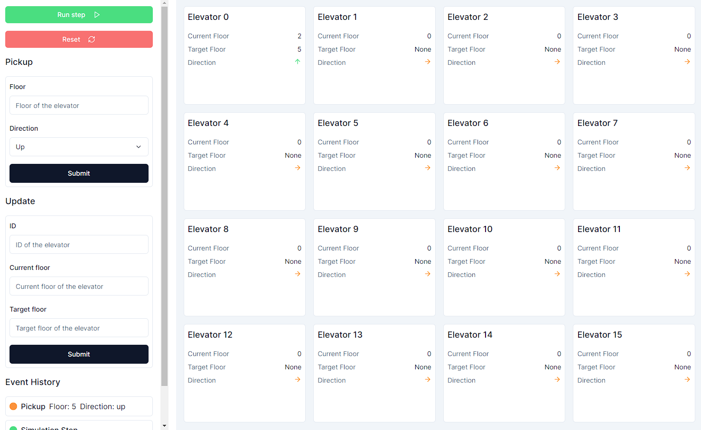

# Elevator System

This project is a simulation of an elevator control system that can manage up to 16 elevators. The system allows for pickup requests, state updates, simulation steps, and status checks through a shared control panel.



## Hosting

The application is hosted publicly and can be accessed at [elevator-system-app.vercel.app](https://elevator-system-app.vercel.app/ "The elevator system app").

## Algorithm

The elevator control system uses a First-Come, First-Serve (FCFS) approach with some optimizations for nearest elevator selection. When an elevator is requested (pickup), the system:
1. Identifies the nearest elevator that can handle the request based on the direction and current floor.
2. Adds the requested floor to the elevator's list of target floors.
3. Sorts the target floors based on the current direction of the elevator to ensure efficient handling of requests.

The system steps the simulation forward by:
1. Moving each elevator one floor closer to its next target floor.
2. Updating the elevator's direction based on the movement.

## System Requirements

- Node.js 18.17 or later
- macOS, Windows and Linux all supported

## Tech Stack

- Next.js
- React
- TypeScript
- Vitest (for testing)

## Installation

1. Clone the repository:

```bash
git clone https://github.com/piotrv1001/elevator-system.git
cd elevator-system
```

2. Install dependencies

```bash
npm install
```

## Usage

To start the development server, run:

```bash
npm run dev
```

## Running Tests

To run the tests, run:

```bash
npm run test
```

## Project Structure

The project uses the Next.js App Router. The most important folders and files include:

- `src/`
  - `app/`: Next.js file-based routing
  - `components/`: React components
  - `hooks/`: Custom React hooks
  - `lib/`: External libraries
  - `types/`: Typescript type definitions
  - `schemas/`: Zod schemas for form validation
- `__tests__/`: Unit tests
- `public/`: Public assets (images, videos etc.)
- `constants.ts`: Global constants
- `package.json`: Project dependencies